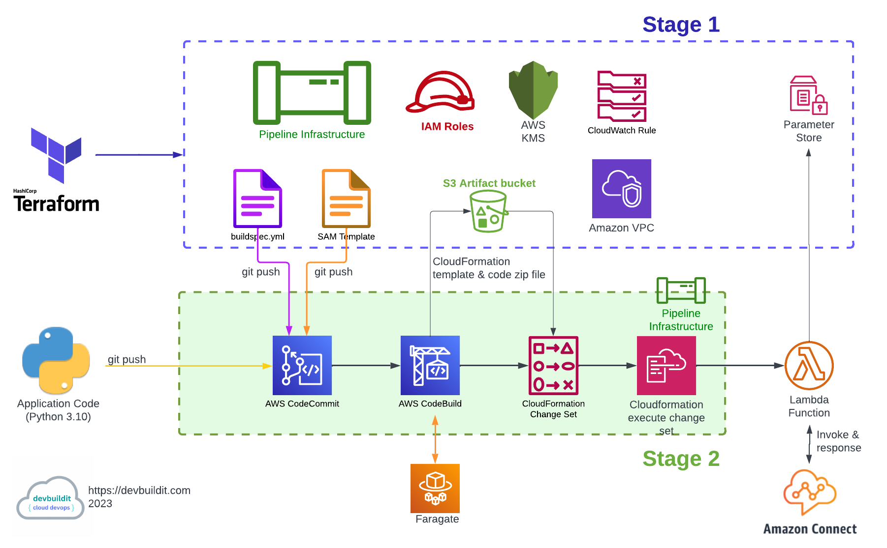

# Overview  

Please see blog site https://devbuildit.com/2023/06/15/aws-lambda-deployment-via-ci-cd-pipeline-and-terraform/ for detailed explaination of this repo contents.

# Installation  
This repo (and associated blog) will create CI/CD pipeline and deploy a lambda function.

Two stage installation (see below):

## Requirements:
- Terraform CLI installed with access to your target AWS account

## Deployment
Stage1
- Clone repo into folder
- change into terraform subfolder
- Update terraform.tfvars to suit your environment
- Run command 'Terraform init'
- Optional Checkov check via  "checkov -d . --download-external-modules True"
- Run command 'Terraform plan' 
- Run command 'Terraform apply' and type 'yes' to confirm deployment

Stage2
- Clone newly created AWS CodeCommit Repo into empty folder
- navigate  apicaller-repo sub folder
- copy samTemplate.yml from terraform apply parent folder to current folder
- copy buildspec.ym from terraform apply parent folder to current folder
- copy appfolder from terraform apply parent folder to current folder
- push code to newly created AWS codecommit repository

## Tidy up
- Manually delete CloudFormation stack apicaller
- Manually empty artifact bucket
- Run command 'Terraform destroy'
 
